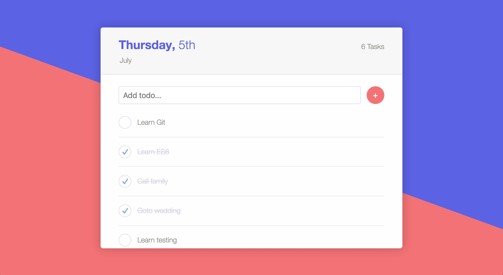

# React Redux Todo App (Redux-Thunk and Redux-Saga)

Simple todo application using firebase. Redux-Thunk and Redux-Saga implementations can be view in their respective branches.



## Setup

From the project root directory, create `src/firebase.js` and add the following:

```javascript
import firebase from 'firebase';

const config = {
  apiKey: YOUR_API_KEY,
  authDomain: YOUR_AUTH_DOMAIN,
  databaseURL: YOUR_DATABASE_URL,
  projectId: YOUR_PROJECT_ID,
  storageBucket: YOUR_STORAGE_BUCKET,
  messagingSenderId: YOUR_MESSAGING_SENDER_ID
};

firebase.initializeApp(config);

export default firebase;

export const database = firebase.database();
```

If you are new to firebase, checkout this [link](https://firebase.google.com/docs/web/setup) to setup the app in the firebase console.

This project was bootstrapped with [Create React App](https://github.com/facebookincubator/create-react-app).
